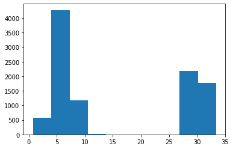
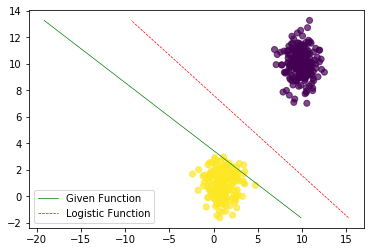

# Machine Learning Algorithms

Basic regression and classification algorithms implemented using gradient descent and expectation maximization.

## Expectation Maximization for mixture of gaussians

Here we have a micture of two gaussian distributions simulated with preset parameters as mu = [30.0,6.0] and sigma = [1.0,1.5]. The figure below shows the estimated distributions using EM algorithm after optimization.

## Linear Classification - Logistic (sigmoid) vs Hyperbolic tangent 

A comparison for sigmoid function and hyperbolic tangent function used in linear binary classification. The figure shows optimized separation plane between the two classes.

